# CarCar

Team:

* Jordan Tran - Sales
* Tracey Chung - Services

## Starting the Application
Install Docker

For MacOS:
```
brew install --cask docker
```

For Windows:
```
winget install Docker.DockerDesktop
```

To start the application, run the following commands:
```
docker volume create pgdata
docker-compose build
docker-compose up
```

## Design
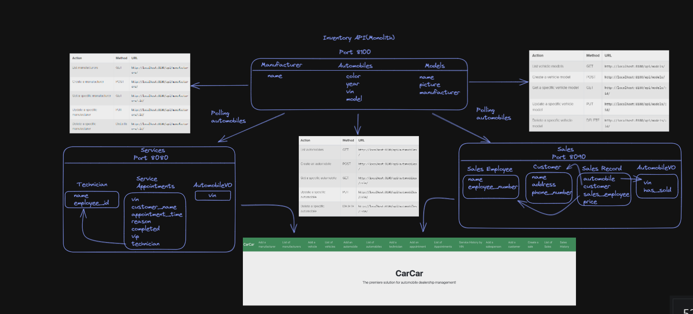


## Service microservice

The `Service` microservice uses port 8080 and has three models: the `ServiceAppointment` model, the `AutomobileVO` model, and the `Technician` model. The `Service` model has a “technician” property which uses the `Technician` model as a foreign key.

- The `ServiceAppointment` model has the following properties. If an appointment has a VIN that is found in the inventory, the “vip” property will be marked as true.

    ```python
    class ServiceAppointment(models.Model):
        vin = models.CharField(max_length=17)
        customer_name = models.CharField(max_length=100)
        appointment_time = models.DateTimeField()
        reason = models.CharField(max_length=250)
        completed = models.BooleanField(default=False)
        vip = models.BooleanField(default=False)
        technician = models.ForeignKey(
            Technician,
            related_name="appointments",
            on_delete=models.CASCADE,
        )
    ```

- The `AutomobileVO` model has the following properties. The `AutomobileVO` model uses a `get_automobiles()` function to poll VIN data from the Inventory monolith, which uses the port 8100.

    ```python
    class AutomobileVO(models.Model):
        vin = models.CharField(max_length=17, unique=True)
    ```

- The `Technician` model has the following properties:

    ```python
    class Technician(models.Model):
        name = models.CharField(max_length=100)
        employee_id = models.PositiveSmallIntegerField(unique=True)
    ```


The `Service` microservices uses RESTFUL APIs to get a list of appointments, create a new appointment, as well as delete, update and show details for a specific appointment. The URLs for the `Service` microservice are shown below. A technician must exist before creating an appointment.

- **Technician**

    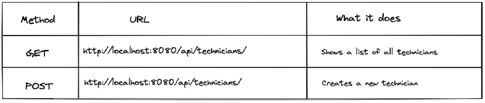

- **ServiceAppointment**

    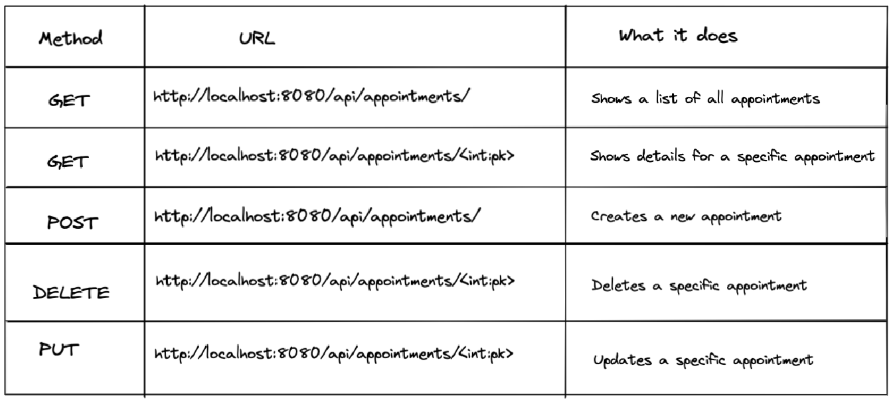


For each route, sample response data can be found below:

- `GET` [http://localhost:8080/api/appointments/](http://localhost:8080/api/appointments/)

    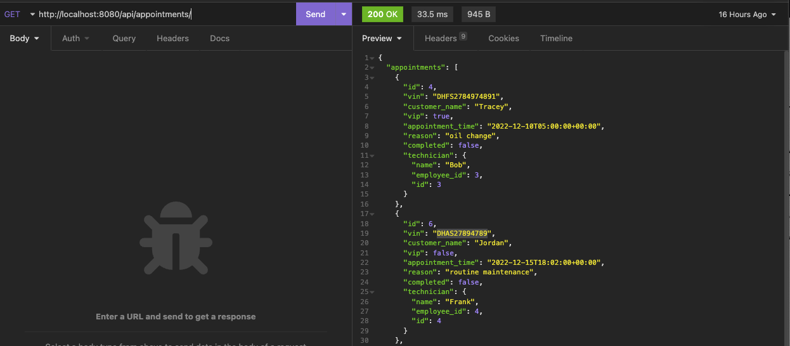

- `POST`  [http://localhost:8080/api/appointments/](http://localhost:8080/api/appointments/)

    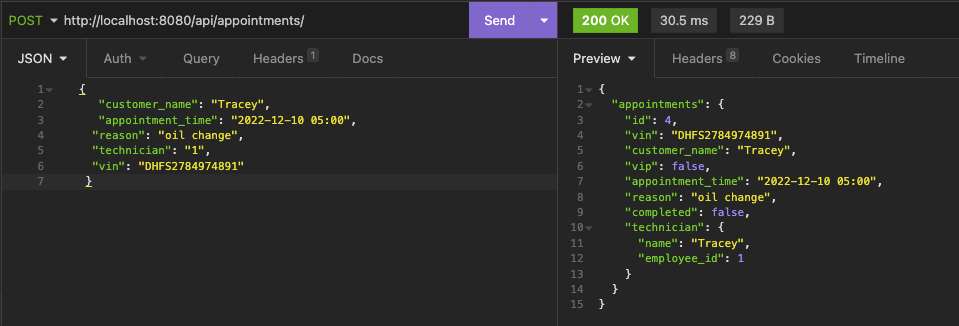

- `GET` [http://localhost:8080/api/appointments/<int:pk>/](http://localhost:8080/api/appointments/1/)

    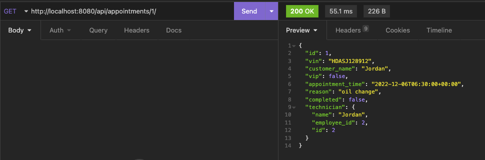

- `PUT` [http://localhost:8080/api/appointments/<int:pk>/](http://localhost:8080/api/appointments/1/)

    

- `DELETE` [http://localhost:8080/api/appointments/<int:pk>/](http://localhost:8080/api/appointments/1/)

    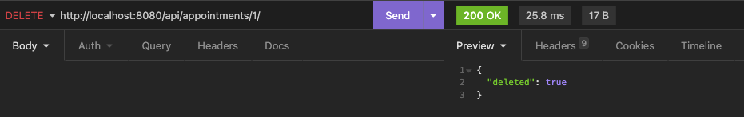

- `GET` [http://localhost:8080/api/technicians/](http://localhost:8080/api/technicians/)

    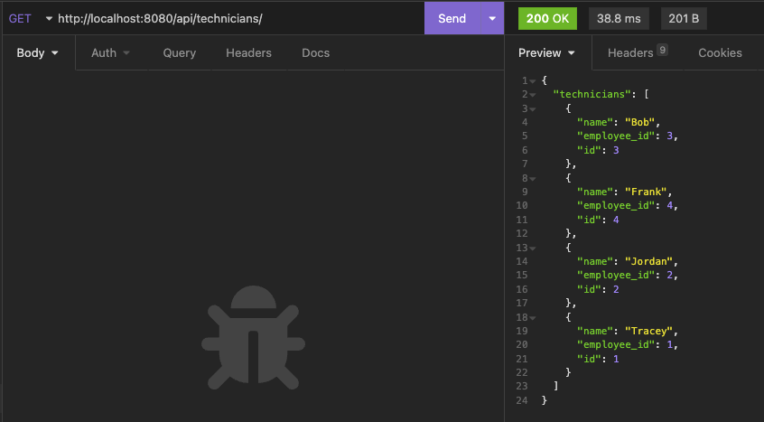

- POST [http://localhost:8080/api/technicians/](http://localhost:8080/api/technicians/)

    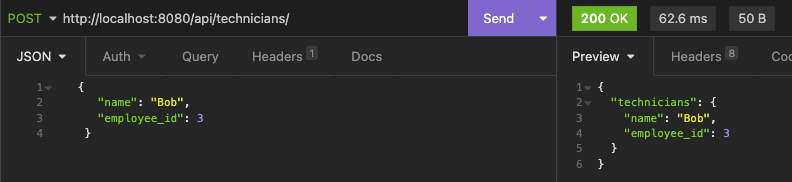


The `Service` front end has four components - `TechnicianForm`, `AppointmentForm`, `AppointmentList`, and `ServiceHistory`. The React frontend can be reached at "localhost:3000".

- `TechnicianForm` creates a form that takes in the Technician’s Name and their Employee ID. It will then take the users input and POST the data to [http://localhost:8080/api/technicians/](http://localhost:8080/api/technicians/).
- `AppointmentForm` creates a form that takes in the customer’s name, appointment time, reason, VIN, and technician. It fetches data from the `Technician` model in order to get a list of technicians to display in the “Technician” dropdown. Once the form is filled, and successfully posted, the new appointment will automatically be displayed in the appointment list.
- `AppointmentList` shows a list of appointments that have yet to be completed. Appointments will each have a VIN, customer name, appointment date and time, technician, reason, VIP status, and a cancel/complete button. If the “Cancel” button is clicked, the appointment will be deleted and removed from the list. If the “Completed” button is clicked, the appointment will update to Complete and will be removed from the list.
- `ServiceHistory` shows a list of all appointments whether they have been completed or not. Each appointment will have a VIN, customer name, appointment date and time, technician, reason and VIP status. There is also a search bar where users can look up specific appointments by VIN or customer name.

## Sales microservice

The `Sales` microservice uses port 8090 and has four models: the`SalesPerson` model, the `AutomobileVO` model, `SalesRecord` and the `Customer` model. The `SalesRecord`model has a “sales_person”, and “customer”,  property which uses the `SalesPerson` and `Customer` model as a foreign key.

The `Sales` microservices uses RESTFUL APIs to get a list of appointments, create a new appointment, as well as delete, update and show details for a specific appointment. The URLs for the `Sales` microservice are shown below.

**Sales Record**

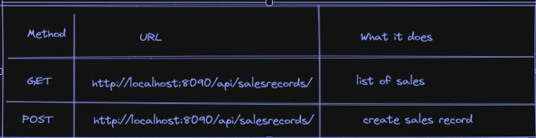

**Customers**

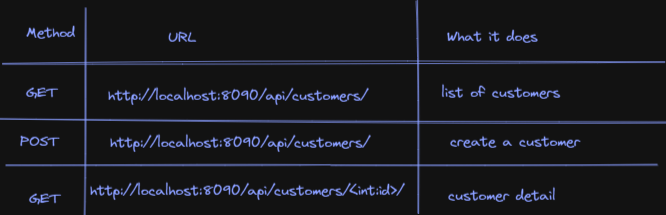

**Employees**

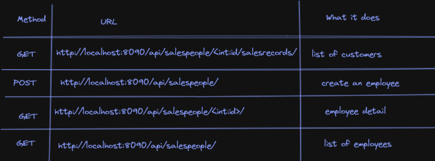

For each route, sample response data can be found below (Employees):

- `GET http://localhost:8090/api/salespeople/`

    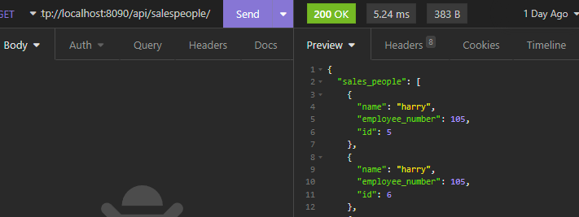

- `POST` [http://localhost:8090/api/salespeople/](http://localhost:8090/api/salespeople/)

    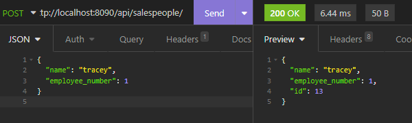

- `GET` [http://localhost:8090/api/salespeople/<int:id>/](http://localhost:8090/api/salespeople/12/)

    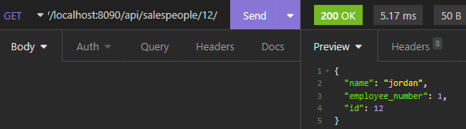

- `GET` [http://localhost:8090/api/salespeople/<int:id>/salesrecords/](http://localhost:8090/api/salespeople/5/salesrecords/)

    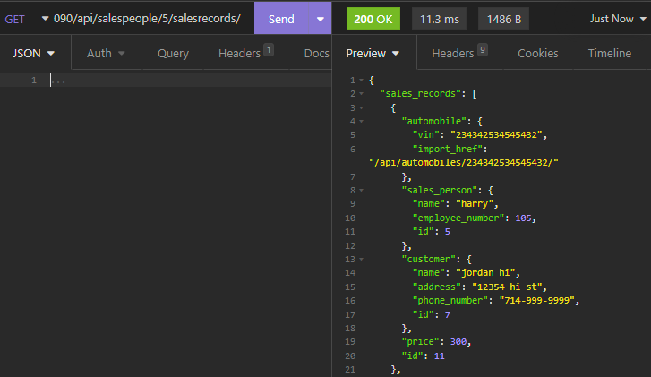


For each route, sample response data can be found below (Customers):

- `GET`[http://localhost:8090/api/customers/](http://localhost:8090/api/customers/)

    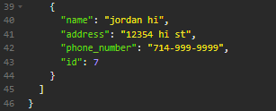

- `POST` [http://localhost:8090/api/customers/](http://localhost:8090/api/customers/)

    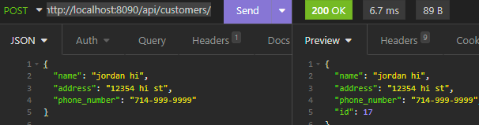

- `GET` [http://localhost:8090/api/customers/<int:id>/](http://localhost:8090/api/customers/8/)

    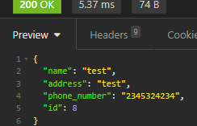


For each route, sample response data can be found below (Sales Records):

- `GET` [http://localhost:8090/api/salesrecords/](http://localhost:8090/api/salesrecords/)

    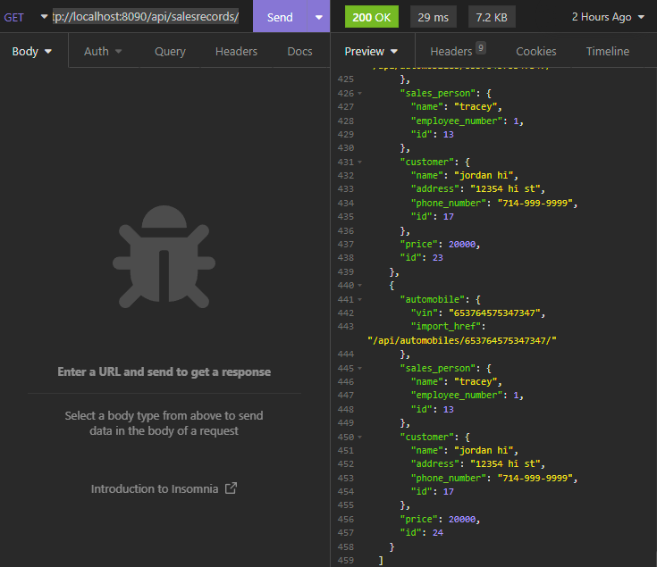

- `POST` [http://localhost:8090/api/salesrecords/](http://localhost:8090/api/salesrecords/)

    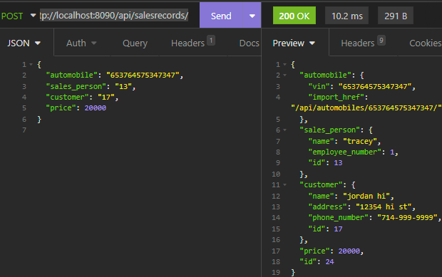

The `Sales` microservice front end side manages customers, employees, sales records, and sales history of an employee. The sales microservice only allows sales of vehicles that are in the inventory that have not been sold off yet.
